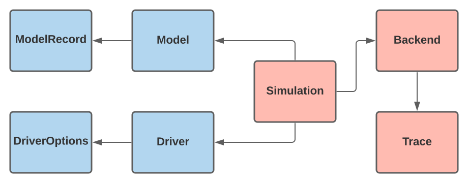

# BlockOpt Interface
The `BlockOpt` package contains an _application programming interface_ introducing behavior of
abstract types of [`AbstractBlockOptType`]. The `BlockOpt` interface extends `AbstractBlockOptType` by declaring subtypes:
- `AbstractModel`: Standard form program defining minimization problem,
- `AbstractRecord`: Container holding logged simulation statistics,
- `AbstractDriver`: Driving parameters of a simulation,
- `AbstractOptions`: Options governing a simulation,
- `AbstractSimulation`: Entry/Exit point of a simulation,
- `AbstractBackend`: The actual iteration of a simulation,
- `AbstractTrace`: Information obtained during simulations.

## Motivation
The interface is motivated by:
- `1` dispatching simulation logic to type-stable abstract methods,
- `2` allow for model integration with other modeling interfaces, e.g `JuMP`, `NLPModels`.
- `3` isolate the simulations iteration behavior in a flexible backend, and
- `4` provide protocol for iteration trace and statistics logging.
**
Each of the seven abstract subtypes define a contract for a concrete implementation to satisfy.
Satisfying the contract requires the concrete type to specify accessor and mutator
methods contracted by the abstract supertype. This gives `1` by requiring accessor/mutator methods the interface can define simulation behavior on the abstract types.

Item `2` is met by implementing the third-party interfaced model types conforming to their respective
interface, and the `AbstractModel` interface. 

The `AbstractBackend` **obtains** copyied information from the `AbstractModel` and `AbstractDriver` by
the `AbstractSimulation`. Then backend has the freedom to compose the iteration structure and
information, so long as the inhereted `AbstractTrace` behavior is met; this gives `3`, so long as `4`.

## Implementation**
The architecture of the `BlockOpt` interface follows the delegation design pattern, where the default implementation is composed as,

here, the blue cells are user exposed types, whereas, the red cells hold internal type-related
information that's accessed/mutated by dispatched abstract methods. The figure's arrows express
a _has-a_ relationships amongst types, e.g. a `Model` _has-a_ `ModelRecord` reference,
or equivalently, we say the `ModelRecord` behavior is delegated to a `Model`.