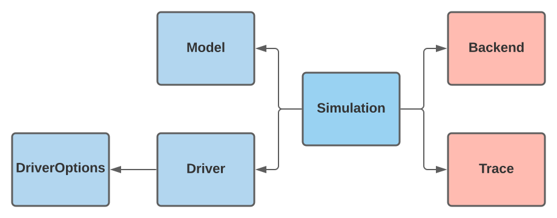

```@meta
CurrentModule = BlockOpt
DocTestSetup = quote
    import BlockOpt: Model, Driver, DriverOptions, Simulation, BlockOptTrace, BlockOptBackend, optimize
end
```

## Design

The `BlockOpt` interface is constructed through a _delegation_ design pattern,
leveraging the behavior of existing types by wrapping them in new types. The figure
below is a visual representation of the `BlockOpt` type delegation, where the arrow
represents a _has-a_ relationship. 
 


Here, the blue shaded types behavior is exported to be interfaced with the user. The red boxs  
hold the iteration information, and any iteration observations, of `Algorithm 7.1`.


The immutable `Driver` _has-a_ mutable `DriverOptions`, which effictively delegates the 
simulation options to the `Driver` via forwarded/inherted functionality. A user-loaded `Model`
and `Driver` instances are passed to the `Simulation` type. Then the `Simulation` controls the
entry-point and exit-point of the iteration. Last, a `Trace` records `Backend` information throughout
the iteration and a Simulation controls the observations information flow. 


## Exported Types
```@docs
DriverOptions
Driver
Model
```

## Internal Types
```@docs
Simulation
BlockOptBackend
BlockOptTrace
```

## Optimize 
```@docs
optimize
```

### Entry Point: `optimize` call.
The entry-point occurs when a user makes a function call to `optimize`.


### Exit Point: `optimize` return. 
Upon an `optimize` call a `Simulation` instance `s` is created and passed to
the fallback method `optimize!(s)` which returns `s` at a terminal state.