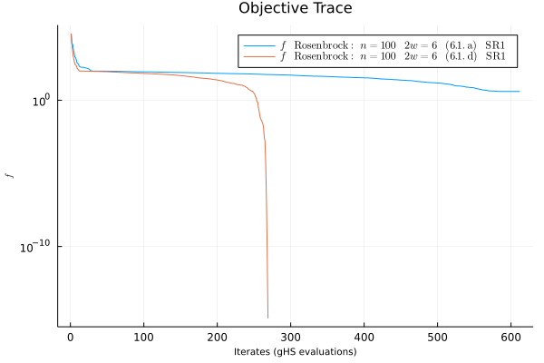
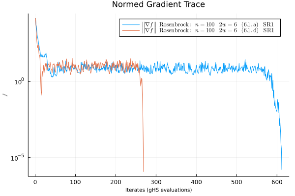

```@meta
CurrentModule = BlockOpt
DocTestSetup = quote
    using BlockOpt
    using LinearAlgebra
end
```


# Simple Use Case

Consider the [generalized rosenbrock](https://en.wikipedia.org/wiki/Rosenbrock_function)
as our objective function


```math
f(x) = \sum_{i=1}^{N-1} \left[100(x_{i+1}^2 - x_i^2)^2 + (1 - x_i)^2\right].
```

We manually translate the formula above into Julia shown below.


```julia-repl
julia> function rosen(x)
           N = lastindex(x)
           100sum((x[i + 1] - x[i]^2)^2 for i = 1:N-1) + sum((x[i] - 1)^2 for i = 1:N-1)
       end
```

Differentiating the objective function and performing a Julia translation below.

```julia-repl
julia> function ∇rosen!(g, x)
           N = lastindex(x)
           g[1] = -2 * (1 - x[1]) - 400x[1] * (-x[1]^2 + x[2])

           for i in 2:N-1
               g[i] = -2 * (1 - x[i]) + 200 * (-x[i - 1]^2 + x[i]) - 400x[i] * (-x[i]^2 + x[1 + i])
           end
           
           g[N] = 200 * (x[N] - x[N-1]^2)    
           return g
       end
∇rosen! (generic function with 1 method)
```

The `optimize` routine will attempt to find ``x`` meeting the first-order neccessary condition 
for being a local minimum of ``f``, i.e.

```math
|| \nabla f(x) || \leq \epsilon.
```


Consider dimension ``n=100,`` and we randomly assign `x₀` to be a point in the
``100``-dimensional hypercube.

```julia-repl
julia> x₀ = randn(100);
```

The entry point of scheme ``7.1`` occurs below.

```julia-repl
julia> optimize(rosen, ∇rosen!, x₀)
SUCCESS 8.070336658758971e-7 ≤ 1.0e-5 in 528 steps
--------------------------------------
  Minimum f:      5.311172726630893e-16
  Minimum ||∇f||: 8.070336658758971e-7
  Minimum Δ:      0.005844719845773086
  Minimum Step:   6.030122388810338e-8

  Model: 
  -------------------
    objective:         rosen
    gradient:          ∇rosen!
    initial iterate:   [0.132719, ..., 0.554169, -0.861590, -0.025498]
    dimension:         100
    directory:         /Users/daniel/.julia/dev/BlockOpt/docs/Missing
    objective formula: missing
  Driver:
  -------------------
    S_update:  S_update_c
    QN_update: SR1
    pflag:     false
    Options:
      samples:        6
      Δ_max:          100.0
      δ_tol:          1.0e-12
      ϵ_tol:          1.0e-5
      max_iterations: 2000
  Trace:
  -------------------
    Weaver:
      f_vals:   [37156.548946, ..., 0.000000, 0.000000, 0.000000]
      ∇f_norms: [15116.003941, ..., 0.000293, 0.000016, 0.000001]
      Δ_vals:   [5.984993, ..., 0.187031, 0.187031, 0.187031]
      p_norms:  [5.172082, ..., 0.000045, 0.000002, 0.000000]
      ρ_vals:   [0.931152, ..., 0.985198, 0.983784, 0.986492]
    Profile:
      trs_counter: 528
      trs_timer:   0.07330679893493652
      ghs_counter: 430
      ghs_timer:   0.07087516784667969
```

Here, the output shows a `Simulation` instance in a terminal state, which happens to be a success!


## Constructing a Model

We extend our simple use case to define a model, which creates a directory to keep track
of various simulations throughout the model's life.

```julia-repl
julia> m = Model("Rosenbrock")
  Model: 
  -------------------
    objective:         missing
    gradient:          missing
    initial iterate:   missing
    dimension:         missing
    directory:         /Users/daniel/.julia/dev/BlockOpt/docs/Rosenbrock
    objective formula: missing
```

Above is an empty model, which is incrementally loaded.

```julia-repl
julia> objective!(m, rosen)
rosen (generic function with 1 method)

julia> gradient!(m, ∇rosen!)
∇rosen! (generic function with 1 method)


julia> initial_iterate!(m, x₀)

julia> m
  Model: Rosenbrock
  -------------------
    objective:         rosen
    gradient:          ∇rosen!
    initial iterate:   [-1.177973, ..., -0.535732, 1.304151, 1.194971]
    dimension:         100
    directory:         /Users/daniel/.julia/dev/BlockOpt/Rosenbrock
    objective formula: missing
```

The model is now loaded to a `final` state, implying that the objective
and gradient function may no longer be modified.  


We optionally chose to set a formula for the objective function of model `m`.
The formula will be displayed when plotting simulations of the `m`.


```julia-repl
julia> rosen_formula = "\$\\sum_{i=1}^{N-1} \\left[100(x_{i+1}^2 - x_i^2)^2 + (1 - x_i)^2\\right]\$";

julia> formula!(m, rosen_formula)
"\$\\sum_{i=1}^{N-1} \\left[100(x_{i+1}^2 - x_i^2)^2 + (1 - x_i)^2\\right]\$"

julia> m
  Model: Rosenbrock
  -------------------
    objective:         rosen
    gradient:          ∇rosen!
    initial iterate:   [-1.177973, ..., -0.535732, 1.304151, 1.194971]
    dimension:         100
    directory:         /Users/daniel/.julia/dev/BlockOpt/Rosenbrock
    objective formula: loaded
```

Our model `m` is entirely constructed. Observe the directory path above;
it was created in the current working directory using the name given to the model constructor.

See the `Model` section of Manual for more information.


## Constructing a Driver
The goal of creating a model is to record simulation information over multiple trials,
where each trial uniquely incorporates the second-order hessian information into a steps QN
update as dictated by the simulation driver.

A default driver is constructed with an empty argument list.

```julia-repl
julia> default_driver = Driver() # default parameters and options
  Driver:
  -------------------
    S_update:  S_update_c
    QN_update: SR1
    pflag:     false
    Options:
      samples:        6
      Δ_max:          100.0
      δ_tol:          1.0e-12
      ϵ_tol:          1.0e-5
      max_iterations: 2000
```

The `default_driver` is created in all `optimize` calls that don't specify a Driver.  


Below we pass `PSB` as argument for the `QN_update` keyword.


```julia-repl
julia> psb_driver = Driver(QN_update = PSB)
  Driver:
  -------------------
    S_update:  S_update_c
    QN_update: PSB
    pflag:     false
    Options:
      samples:        6
      Δ_max:          100.0
      δ_tol:          1.0e-12
      ϵ_tol:          1.0e-5
      max_iterations: 2000
```

See `pflag`, `S_update`, and `Options` manual section for information on the three other keyword arguments.


## Configurations

By passing a model to `optimize` with several unique drivers, we gain
insight into the effects of each driver configuration.
We saw above how `m` performed with the default driver configuration;
now, we run it with the `PSB` QN update


``` julia-repl
julia> optimize(m, psb_driver)
FAIL 3.566862431214296 ≰ 1.0e-5 in 2000 steps
--------------------------------------
  Minimum f:      28.577172626527943
  Minimum ||∇f||: 1.1239260593910936
  Minimum Δ:      0.0055605929272336966
  Minimum Step:   0.005560592927233694

  Model: Rosenbrock
  -------------------
    objective:         rosen
    gradient:          ∇rosen!
    initial iterate:   [-1.177973, ..., -0.535732, 1.304151, 1.194971]
    dimension:         100
    directory:         /Users/daniel/.julia/dev/BlockOpt/Rosenbrock
    objective formula: $\sum_{i=1}^{N-1} \left[100(x_{i+1}^2 - x_i^2)^2 + (1 - x_i)^2\right]$
  Driver:
  -------------------
    S_update:  S_update_c
    QN_update: PSB
    pflag:     false
    Options:
      samples:        6
      Δ_max:          100.0
      δ_tol:          1.0e-12
      ϵ_tol:          1.0e-5
      max_iterations: 2000
  Trace:
  -------------------
    Weaver:
      f_vals:   [35819.088644, ..., 28.644942, 28.610707, 28.577173]
      ∇f_norms: [14013.886569, ..., 3.567714, 3.387636, 3.566862]
      Δ_vals:   [5.694047, ..., 0.044485, 0.044485, 0.044485]
      p_norms:  [4.372943, ..., 0.014306, 0.014309, 0.014314]
      ρ_vals:   [1.128439, ..., 1.664845, 1.670837, 1.665141]
    Profile:
      trs_counter: 2000
      trs_timer:   3.959573268890381
      ghs_counter: 1974
      ghs_timer:   0.4726881980895996
```

Here, the simulation failed to reach a successful terminal state and
instead reached the maximum allowed iterations. We expect that the `PSB`
update requires more iterations than the default `SR1` update. Letting
this guide us, we increase the `max_iterations` of the `psb_driver`
to a larger value.

```julia-repl
julia> max_iterations!(psb_driver, 10000)
10000

julia> optimize(m, psb_driver)
SUCCESS 9.93303363395617e-6 ≤ 1.0e-5 in 5578 steps
--------------------------------------
  Minimum f:      3.986623854354119
  Minimum ||∇f||: 9.93303363395617e-6
  Minimum Δ:      0.004905284751681128
  Minimum Step:   6.309128627600796e-8

  Model: Rosenbrock
  -------------------
    objective:         rosen
    gradient:          ∇rosen!
    initial iterate:   [-1.177973, ..., -0.535732, 1.304151, 1.194971]
    dimension:         100
    directory:         /Users/daniel/.julia/dev/BlockOpt/Rosenbrock
    objective formula: $\sum_{i=1}^{N-1} \left[100(x_{i+1}^2 - x_i^2)^2 + (1 - x_i)^2\right]$
  Driver:
  -------------------
    S_update:  S_update_c
    QN_update: PSB
    pflag:     false
    Options:
      samples:        6
      Δ_max:          100.0
      δ_tol:          1.0e-12
      ϵ_tol:          1.0e-5
      max_iterations: 10000
  Trace:
  -------------------
    Weaver:
      f_vals:   [35819.088644, ..., 3.986624, 3.986624, 3.986624]
      ∇f_norms: [14013.886569, ..., 0.000010, 0.000011, 0.000010]
      Δ_vals:   [5.023012, ..., 0.039242, 0.039242, 0.039242]
      p_norms:  [4.096592, ..., 0.000000, 0.000000, 0.000000]
      ρ_vals:   [1.160497, ..., 1.756820, 1.760699, 1.763252]
    Profile:
      trs_counter: 5578
      trs_timer:   0.891240119934082
      ghs_counter: 5552
      ghs_timer:   0.9388515949249268
```

Allowing for ``10,000`` iterations is more then enough to reach convergence
within the the tolerance given by `ϵ_tol(psb_driver)` (``1.0e-5``). 

See the `Options` and `Driver` sections of the Manual for more information
on `Driver` options and configurations. 


## Simulation Recipes

Let us assign the variables `s1` and `s2` as returned terminal simulations driven by
drivers `d1` and `d2` as defined below.

```julia-repl
julia> d1 = Driver(S_update=S_update_a)
julia> d2 = Driver(S_update=S_update_d)
julia> s1 = optimize(m, d1);
julia> s2 = optimize(m, d2);
```

We have configured drivers `d1` and `d2` to use updates (6.1.a) and (6.1.d).


Next, we create the objective function trace plot with the Julia `Plots` package.
The plotted data may be accessed using `f_vals(s1) and f_vals(s2)`.

```julia-repl
julia> using Plots;     # to install: using Pkg; Pkg.add("Plots")
julia> objtrace(s1, s2)
```




The normed gradient data at each successful iterate may be accessed through `∇f_norms(s1)` and
`∇f_norms(s2)`.

```julia-repl
julia> gradtrace(s1, s2)
```



See: `radiustrace`, `steptrace`, `rhotrace` and corresponding `!` versions.


## Weave

Building upon the last example, we can skip generating the individual plots
and weave one Weave.jl trace report.

```julia-repl
julia> Using Plots
julia> weave(s1, s2);
```

The model directory of `s1` now contains a [trace.html report](../assets/trace.html) which can
be viewed in the browser.


[Here](../assets/trace-2.html) is another report comparing the generalized Rosenbrock simulations
driven by the $6$ different sample direction update configurations.


[Here](../assets/trace-3.html) is a block size comparison of using $4$ to $20$
different sample directions with the `SR1` update and  `S_update=(6.1.d)`. We are
still using model `m`.


